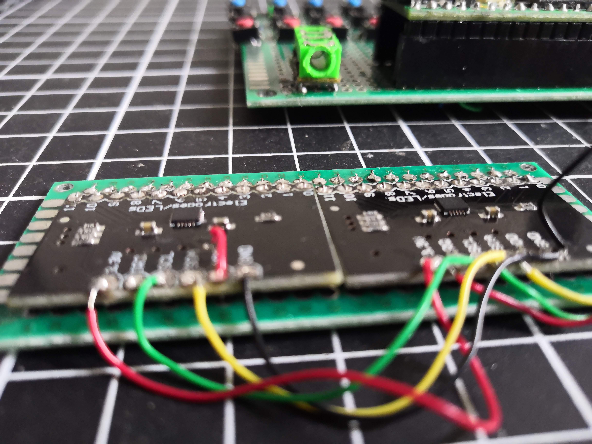
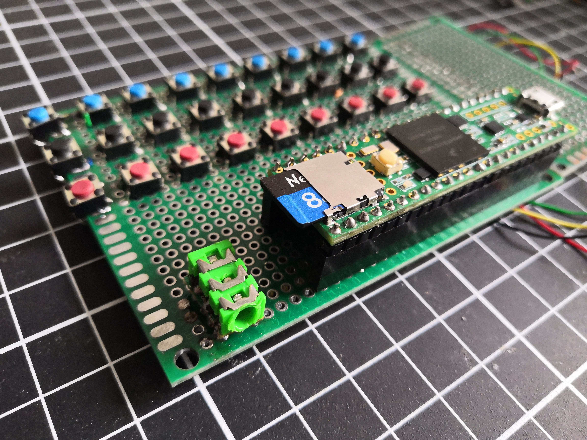
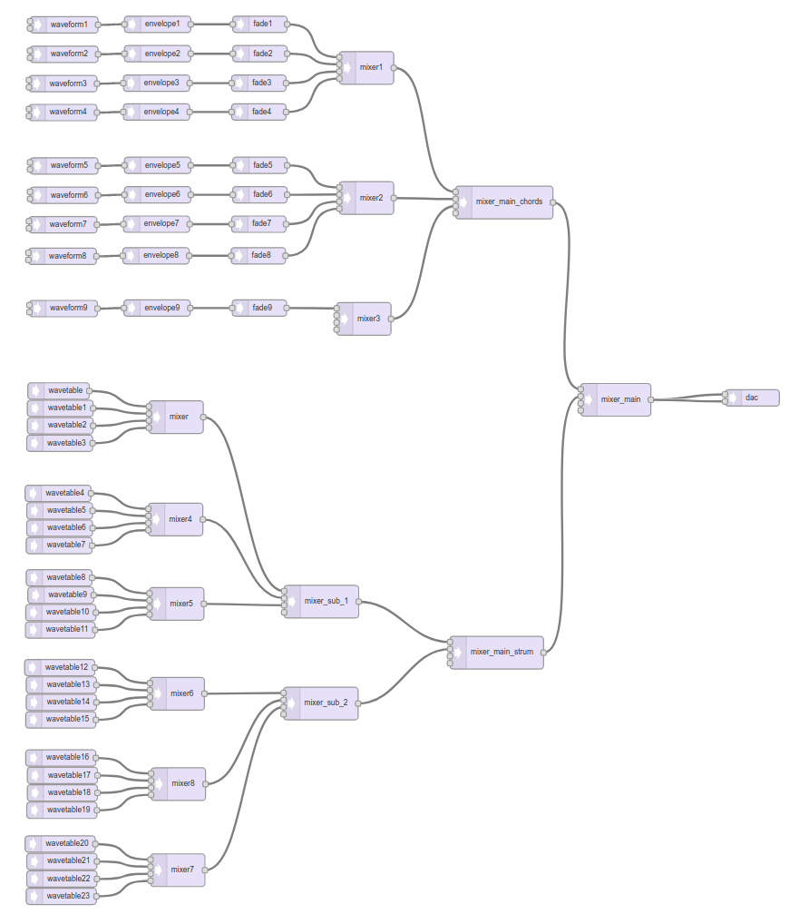

#### 2 MPR121 connected to a Teensy 3.5 via I2C, they act as a the omnichord's "strumbar"

#### 3 rows of 9 buttons for major, minor and 7th chords and a jack connector

#### the main logic of the project :

